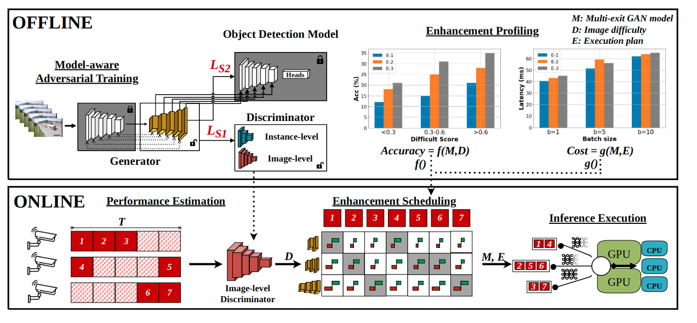

# Turbo: Opportunistic Enhancement for Edge Video Analytics
### [Project Page](https://sites.google.com/view/turbo-video/home) | [Paper](https://jason-cs18.github.io/assets/paper/sensys22turbo.pdf) | [Slides](https://jason-cs18.github.io/assets/slides/Turbo_SenSys_Presentation.pdf)


This repository contains the official implementation of the SenSys'22 paper:  
**Turbo: Opportunistic Enhancement for Edge Video Analytics**.  
[Yan Lu](https://jason-cs18.github.io/), [Shiqi Jiang](https://www.microsoft.com/en-us/research/people/shijiang/), [Ting Cao](https://www.microsoft.com/en-us/research/people/ticao/), [Yuanchao Shu](https://www.microsoft.com/en-us/research/people/yushu/publications/).  
The paper introduces **Turbo** which selectively enhances incoming frames based GPU resource availability via a detector-specific GAN and a resource-aware scheduling algorithm.

Source code and docs for Turbo

## Installation
We provide all [dockerfiles](https://github.com/efficient-edge/Turbo/blob/main/Docker/readme.md) for NVIDIA GPU users to complete different tasks (training, testing, deployment and visualization). Thus, users only need to build the specific docker image for a component and then conduct all experiments in the docker container.
## Source code (file structure and TODO)
- [ ] Trion: convert detectors to TensorRT models and deploy them on Triton.
  - [ ] model_convert.sh: convert pytorch/tensorflow detectors to tensorrt detectors.
  - [ ] model_configure.sh: generate the model configs of tensorrt detectors for triton.
  - [ ] triton_server.sh: start a triton server in docker mode with all deployed tensorrt detectors
  - [ ] triton_client.sh: start a triton client application to send/receive a video.
  - [ ] visualization.ipynb: analysis and visualize results (bboxes, mAP and resource usage). 
- [ ] VAP: use advanced video analytics pipelines as data preprocessing techniques.
  - [ ] vap.sh: leverage different video analytics pipelines (Glimpse, Vigil, NoScope) to preprocess an given video.
- [ ] Scheduling: enable resource-aware scheduling algorithms on Triton with a specific video analytics pipeline.
  - [ ] profiler.sh: profile detectors on pre-trained or customized data
  - [ ] scheduler.sh: compute the idle resources and assign the specific detector to a frame.
- [ ] GAN: train and evaluate the enhancer on pre-train data.
  - [ ] gan_train.sh: preprocessing pre-train data and training an enhancer on it.
  - [ ] gan_evaluate.ipynb: visualize and analysis training/testing logs.
- [ ] E2E: run enhancers with a specific video analytics pipeline and a elastic scheduling algorithm on Triton.
  - [ ] offline.sh: profile accuracy and latency for all enhancer models.
  - [ ] online_server.sh: run a triton server with all deployed enhancers and detectors.
  - [ ] online_client.sh: run a triton client application to send/receive videos/results.
  - [ ] visualization.ipynb: parse and visualize results (accuracy, latency and resource usage).  
- [ ] Scripts: all scripts for Turbo.
  - [ ] preprocess.py: preprocessing code for AICity and UADetrac.
  - [ ] trainer.py: training code for GAN.
  - [ ] evaluate.py: evaluation code on outputs and ground-truth.
  - [ ] vap.py: preprocessing code for an given video based on different video analytics pipelines.
  - [ ] resource_consume.py: parse resource usage (log) and save them as human-readable format.
  - [ ] idle_resource.py: compute the idle resources for an given video, detector and a specific video analytics pipeline.
  - [ ] scheduler.py: assign the suitable detector to each frame based on an given idle resource and profiling results.
  - [ ] profiler.py: profile accuracy and latency of detectors. 
  - [x] model_convert_torch.py: convert yolov3 and fasterrcnn to tensorrt formats.
  - [x] model_convert_tf.py: convert efficientdet-dx to tensorrt formats.
  - [x] model_configure.py: generate configure files for any tensorrt models.
  - [ ] parse_result.py: xxx
## Documentations
1. [Test Detectors (yolov3, faster-rcnn, efficientdet-dx) on Triton](https://github.com/efficient-edge/Turbo/tree/main/Triton)
2. [Integrate with Video Analytics Pipelines](https://github.com/efficient-edge/Turbo/tree/main/VAP)
3. [Enable Resource-Aware Scheduling](https://github.com/efficient-edge/Turbo/tree/main/Scheduling)
4. [GAN (enhancer) Pre-Training](https://github.com/efficient-edge/Turbo/tree/main/GAN)
5. [End2end Experiments](https://github.com/efficient-edge/Turbo/tree/main/E2E)
## Demo
[Demo for Turbo](https://github.com/efficient-edge/Turbo/blob/main/Demo/readme.md)
## Reference
1. [Open-MMLab mmdeploy](https://github.com/open-mmlab/mmdeploy): convert detectors (yolov3 and fasterrcnn) to TensorRT models.
2. [TensorRT Efficient-TensorRT8](https://github.com/NVIDIA/TensorRT/blob/96e23978cd6e4a8fe869696d3d8ec2b47120629b/demo/EfficientDet/notebooks/EfficientDet-TensorRT8.ipynb): convert detectors (efficientdet-dx) to TensorRT models.
3. [Nvidia Triton](https://github.com/triton-inference-server/server): build and deploy detectors on Triton server. 
## Citing Turbo
If you find this project is useful to your research, please consider cite it.
```
@inproceedings{lu22sensys, 
  author={Lu, Yan and Jiang, Shiqi and Cao, Ting and Shu, Yuanchao}, 
  booktitle={ACM Conference on Embedded Network Sensor Systems (SenSys)}, 
  title={{Turbo: Opportunistic Enhancement for Edge Video Analytics}}, 
  year={2022},
}
```